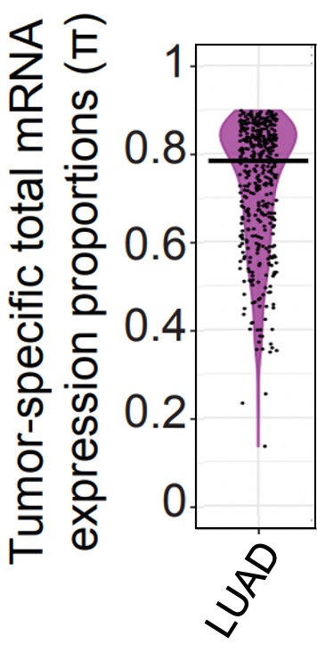
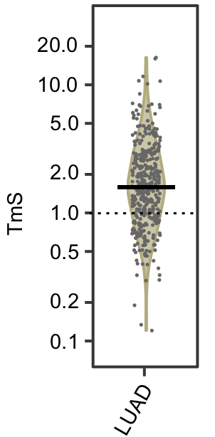

We use the bulk RNAseq data generated from patients with lung adenocarcinoma (LUAD) from the TCGA study ([https://portal.gdc.cancer.gov/](https://portal.gdc.cancer.gov/)) to demonstrate how to calculate TmS values. The analysis pipeline consists of the following steps:
 
   - **Step 1**:  Estimate the proportion of total RNA expression ($\pi$) from tumor cells using RNAseq
data. 
   - **Step 2**: Estiamte the proportion of tumor cells and total copies of haploid genomes, i.e., tumor purity ($\rho$) and tumor ploidy ($\psi$), using matched DNAseq or SNP array data.
   - **Step 3**: Calculate TmS, the per cell haploid genome total RNA expression for tumor, using the estimated ($\pi$), ($\rho$) and ($\psi$): $TmS=[\pi(1-\rho)2]/[(1-\pi)\rho\psi]$.

### Step 1. Estimate the proportion of total RNA expression ($\pi$) from tumor cells using RNAseq data.

This step is achieved by using ``DeMixT``, which has included a new profile likelihood approach that selects intrinsic tumor signature genes for the proportion estimation. We suggest users to visit our ``DeMixT`` [tutorial page](https://wwylab.github.io/DeMixT/tutorial.html) for the detailed instructions on how to best estimate $\pi$. In this step, we performed quality control on both the tumor and normal samples to remove any suspicious samples. Please check the code [DeMixT_preprocessing.R](https://wwylab.github.io/DeMixT/etc/DeMixT_preprocessing.R) for details. 

Here, we display the estimated $\pi$ for TCGA LUAD tumor samples using the violin plot below.

<center>

</center>

### Step 2: Estiamte tumor purity ($\rho$) and tumor ploidy ($\psi$) using matched DNAseq or SNP array data.

Due to the weak identifiability of tumor ploidy ($\psi$), we recommend using two callers, e.g., [ASCAT](https://www.crick.ac.uk/research/labs/peter-van-loo/software) and [ABSOLUTE](https://software.broadinstitute.org/cancer/cga/absolute), to derive a consensus estimate [1]. See further details in **Step 3**.

### Step 3: Calculate TmS using the estimated ($\pi$), ($\rho$) and ($\psi$).

#### Consensus TmS estimation

For DNA-based deconvolution methods such as ASCAT and ABSOLUTE, there could be multiple tumor purity $\rho$ and ploidy $\psi$ pairs that have similar likelihoods. Both ASCAT and ABSOLUTE can accurately estimate the product of purity $\rho$ and ploidy $\psi$; however, they sometimes lack power to identify  and  separately. TmS is derived from the product of tumor ploidy and the odds of tumor purity. Hence, it is potentially more robust to ambiguity in the tumor purity and ploidy estimation, ensuring the robustness of the TmS calculation. 

To calculate one final set of TmS values for a maximum number of samples, we use a consensus approach. We first calculate TmS values with tumor purity and ploidy estimates derived from both ABSOLUTE and ASCAT, and then fit a linear regression model on the log2-transformed TmS<sub>ASCAT</sub> using the log2-transformed TmS<sub>ABSOLUTE</sub> as a predictor variable. We remove samples with Cook’s distance ≥ 4/n and calculate the final $TmS=\sqrt{TmS_{ASCAT}\times TmS_{ABSOLUTE}}$). 
The agreement between the two methods in ploidy values was low in 20% of TCGA samples. However, a large portion of these samples showed consistency in the TmS values using either ASCAT and ABSOLUTE, reducing the number of filtered TCGA samples to ~5% (264 samples) [1]. This result supports the robustness of our consensus approach.


**Input**: Tumor-specific total mRNA proportions, tumor purities, tumor ploidies\
**Output**: Consensus TmS

- ``p``: Tumor-specific total mRNA proportions estimated by DeMixT
- ``rho_ASCAT``: tumor purity estimated by ASCAT
- ``phi_ASCAT``: tumor ploidy estimated by ASCAT
- ``rho_ABSOLUTE``: tumor purity estimated by ABSOLUTE
- ``phi_ABSOLUTE``: tumor ploidy estimated by ABSOLUTE
  
```
TmS.calculate = function(p, rho, phi){
  return(2 * p * (1 - rho) / (phi * rho * (1 - p)))
}

TmS.ASCAT = TmS.calculate(p, rho_ASCAT, phi_ASCAT)
TmS.ABSOLUTE = TmS.calculate(p, rho_ABSOLUTE, phi_ABSOLUTE)

TmS.df = data.frame(TmS.ASCAT.log2 = log2(TmS.ASCAT), 
                    TmS.ABSOLUTE.log2 = log2(TmS.ABSOLUTE))

lm.fit = lm(TmS.df$TmS.ABSOLUTE.log2 ~ TmS.df$TmS.ASCAT.log2)
summary(lm.fit)
cooksd = cooks.distance(lm.fit)
cooksd.threshold = 4 / nrow(TmS.df)

cook.status = rep("Accept", nrow(TmS.df))
cook.status[cooksd > cooksd.threshold] = "Outlier"
TmS.df = TmS.df[cook.status == "Accept", ]

Consensus.TmS = sqrt(exp(TmS.df$TmS.ASCAT.log2)*exp(TmS.df$TmS.ABSOLUTE.log2))
```

The estimated TmS values for TCGA LUAD tumor samples are shown in the violin plot below. The majority of the samples are with TmS > 1, indicating a higher total mRNA expression per haploid genome in tumor cells than that of the non-tumor cells in these samples. 

<center>

</center>

## Source code

 
## Reference

[1] Cao, S. et al. Estimation of tumor cell total mRNA expression in 15 cancer types predicts disease progression. Nat Biotechnol (2022). https://doi.org/10.1038/s41587-022-01342-x.
